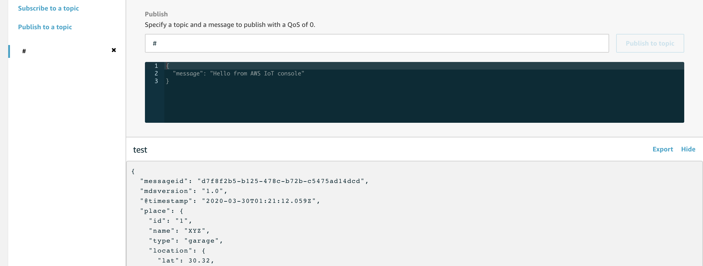

# AWS IoT Core Integration with NVIDIA DeepStream
This project implements protocol adaptor between NVIDIA DeepStream SDK and AWS (edge to cloud messaging).
The adaptor implements the API for client applications to publish inference results or metadata using MQTT messages to AWS IoT Core.

## Pre-requisites

* AWS account admin console access (for this tutorial)
* A Jetson device with DeepStream SDK installed and public internet access
* Gstreamer installation as described in the [NVIDIA documentation](https://docs.nvidia.com/jetson/l4t/index.html#page/Tegra%20Linux%20Driver%20Package%20Development%20Guide/accelerated_gstreamer.html)

For the convenience of this installation, we can create an environment variable of the path where you DeepStream SDK is installed. Please replace <DeepStream SDK PATH> to the path of your DeepStream SDK on your Jetson device. (For DeepStream 5.0, the default installation path is "/opt/nvidia/deepstream/deepstream-5.0/".)
```
export DEEPSTREAM_SDK_PATH=<DeepStream SDK PATH>
```

## Installation Guide:
### Step 1: Download AWS DeepStream adaptor

In your Jetson device, navigate to Downloads folder, then download or clone the [AWS managed GitHub](https://github.com/awslabs/aws-iot-core-integration-with-nvidia-deepstream) repo. Copy the aws_protocol_adaptor sub-folder to  ${DEEPSTREAM_SDK_PATH}/sources/libs.
```
cd ~/Downloads
git clone https://github.com/awslabs/aws-iot-core-integration-with-nvidia-deepstream.git
cd aws-iot-core-integration-with-nvidia-deepstream
cp -r aws_protocol_adaptor ${DEEPSTREAM_SDK_PATH}/sources/libs
```

### [Optional] Step 2: Manually build the shared library (You can skip this step if you want to use the .so file that we built for you.)

he shared library (.so file) is built and checked in the git repo you cloned in Step 1 in the aws_protocol_adaptor/device_client directory. If you want to build and customize your shared library, you can follow step 2 to compile with customized features such as optimized buffer size for incoming or outgoing MQTT messages, or TLS connection timeout values.

If cloned or downloaded successfully, aws_protocol_adaptor should appear in your current path. Next, we need to create an empty directory for [AWS IoT device SDK](https://github.com/aws/aws-iot-device-sdk-embedded-C) library. We also need to clone the [AWS IoT device SDK](https://github.com/aws/aws-iot-device-sdk-embedded-C) in Embedded-C version 3 into this empty directory we created.
```
mkdir ${DEEPSTREAM_SDK_PATH}/sources/libs/aws_protocol_adaptor/aws-iot-sdk
cd ${DEEPSTREAM_SDK_PATH}/sources/libs/aws_protocol_adaptor/aws-iot-sdk
git clone https://github.com/aws/aws-iot-device-sdk-embedded-C.git .
```
This AWS IoT device SDK has an external dependency on Mbed TLS, so navigate to aws-iot-sdk/external_libs/. And clone the existing Mbed TLS repo in this folder:

```
cd ${DEEPSTREAM_SDK_PATH}/sources/libs/aws_protocol_adaptor/aws-iot-sdk/external_libs/mbedTLS
git clone https://github.com/ARMmbed/mbedtls.git
```
Navigate to device_client folder, and compile the shared library:
```
cd ${DEEPSTREAM_SDK_PATH}/sources/libs/aws_protocol_adaptor/device_client
make clean
make
```
If you inspect this current folder, you should see the libnvds_aws_proto.so file just updated.

### Step 3: Provision DeepStream App with AWS IoT credentials
Navigate to AWS web console, and go to *IoT Core* service. On the left-side menu, click on *Secure* → *Policies*. And on the right upper corner, click on *Create*. A window would appear to help you create a policy for your thing you are about to create for DeepStream Application. You can also do this with AWS CLI. Please refer to [AWS IoT Policy Elements](https://docs.aws.amazon.com/iot/latest/developerguide/example-iot-policies-elements.html) for list of actions in AWS IoT to allow or deny.

After creating the policy, you can then create a thing for DeepStream Application. You can do this on AWS console by going to the left-side AWS IoT service page, click on *Manage->Things.* And on the right upper corner, click on *Create*. This would start the process of creating a thing on AWS IoT. You can also do this with AWS CLI. Please note down the thing name you have used to create this thing, you will later need it.

If you are using AWS console, after creating the thing, a new page would appear with download links for the certificates we just generated for this thing, download all of them. For root certificate, a link would redirect you to a root certificate download page. You can download Amazon Root CA1. And you can click on the *Activate* button on this page to activate the set of certificates that you just downloaded.

Then click on *Attach Policy*, and choose the policy named *ds_app_policy* you just created.

### Step 4: Transfer certificates to Jetson device
Navigate to the path of your downloaded certs. You should see four files in the following naming format:
```
XXX-certificate.pem.crt
XXX-private.pem.key
XXX-public.pem.key
AmazonRootCA1.pem
``` 
You can change them to:
```
certificatePem.cert.pem
privateKey.private.key
publicKey.public.key
root.ca.pem
```
You can then make a cert folder on your Jetson device, and transfer these downloaded certificates and keys to your Jetson device. In this demo, we are going to put these certificates in the following directory. 
```
mkdir ${DEEPSTREAM_SDK_PATH}/sources/libs/aws_protocol_adaptor/device_client/certs
mv <4 CERTS FILES> ${DEEPSTREAM_SDK_PATH}/sources/libs/aws_protocol_adaptor/device_client/certs
```
On your Jetson device, navigate to:
```
cd ${DEEPSTREAM_SDK_PATH}/sources/libs/aws_protocol_adaptor/device_client/ 
```
Edit cfg_aws.txt:
* Replace <YOUR IOT HOST ADDRESS> with your AWS IoT Endpoint URL, which can be found in the AWS IoT console → setting, in the box showing Endpoint.
* Replace <DEEPSTREAM SDK PATH> to the *absolute* *path* of your DeepStream SDK PATH. (WARNING: Using relative path sometimes would cause certificate parsing failure error).
* Replace the values of both ThingName and ClientID with the name of the thing created above. 

### Step 5: Run Deepstream App
We are going to use the test apps developed by NVIDIA to verify our adaptor setup. We are going to run tests with both test4 and test5 in NVIDIA DeepStream SDK sample app folder. The deepstream-test4 can be used to demonstrate adding custom objects as NVDS_EVENT_MSG_META user metadata with buffers for generating a custom payload to be published to AWS IoT Core. The deepstream-test5 can demonstrate how to use "nvmsgconv" and "nvmsgbroker" plugins in the pipeline, create NVDS_META_EVENT_MSG type of meta, and upload to AWS IoT Core. Both apps can help verify the installation and functionalities of this message broker.
#### Test App 4
Please first navigate to test4 in your DeepStream SDK, and make the app:
```
cd ${DEEPSTREAM_SDK_PATH}/sources/apps/sample_apps/deepstream-test4
make
```
Then, you can use the following command to run test4.
```
./deepstream-test4-app -i ../../../../samples/streams/sample_720p.h264 -p ../../../libs/aws_protocol_adaptor/device_client/libnvds_aws_proto.so --conn-str=hello -c ../../../libs/aws_protocol_adaptor/device_client/cfg_aws.txt -t test --no-display
```
Now navigate to AWS IoT console, and on the menu bar on the left, click on test, type in test (or # to receive messages on all topics) in the subscription topic box, and click on *Subscribe to topic*, you should see MQTT messages start to show up on this console after app successfully runs:


#### Test App 5
Please navigate to test5 in your DeepStream SDK, and make the app
```
cd ${DEEPSTREAM_SDK_PATH}/sources/apps/sample_apps/deepstream-test5
make
```
In order to run deepstream-test5, you also need to modify your configuration file to point at the shared library.
```
cp configs/test5_config_file_src_infer.txt configs/test5_config_file_src_infer_aws.txt 
vim configs/test5_config_file_src_infer_aws.txt
```
You can then, modify msg-broker-proto-lib under your message broker sink (sink1), to point to:
${DEEPSTREAM_SDK_PATH}/sources/libs/aws_protocol_adaptor/device_client/libnvds_aws_proto.so.
And also modify msg-broker-config under the same sink to point to:
${DEEPSTREAM_SDK_PATH}/sources/libs/aws_protocol_adaptor/device_client/cfg_aws.txt
Next, you need to modify the topic to a topic name that you choose, and modify the first sink to a fake sink. Then, you can use the following command to run test5:
```
./deepstream-test5-app -c configs/test5_config_file_src_infer_aws.txt 
```
Now navigate to AWS IoT console, and on the menu bar on the left, click on test, type in test (or # to receive messages on all topics) in the subscription topic box, and click on *Subscribe to topic*, you should see MQTT messages start to show up on this console after app successfully runs.


#### Processing IoT messages with AWS IoT rule
Once you see messages coming into AWS IoT Core, there are a lot of options to further process them or store them on AWS cloud. One simple example would be to push these messages, using AWS IoT Rules, to a customized AWS Lambda function, which parses the messages and puts them in Amazon DynamoDB. You may find the following documents helpful in setting up this IoT rule to storage pipeline: 
* [Creating a Rule with a AWS Lambda Action](https://docs.aws.amazon.com/iot/latest/developerguide/iot-lambda-rule.html) 
* [Reading and Writing A Single Item in DynamoDB](https://docs.aws.amazon.com/sdk-for-javascript/v2/developer-guide/dynamodb-example-table-read-write.html) 
* [Implementing a Serverless AWS IoT Backend with AWS Lambda and Amazon DynamoDB](https://aws.amazon.com/blogs/compute/implementing-a-serverless-aws-iot-backend-with-aws-lambda-and-amazon-dynamodb/)

The following documents may further assist you building a more production-ready data pipeline:
* [AWS IoT Analytics Console Quick Start Guide](https://docs.aws.amazon.com/iotanalytics/latest/userguide/quickstart.html)
* [Integrating IoT data with your data lake with new AWS IoT Analytics features](https://aws.amazon.com/blogs/iot/integrating-iot-data-with-your-data-lake-with-new-aws-iot-analytics-features/)
* [Real-Time IoT Device Monitoring with Kinesis Data Analytics](https://aws.amazon.com/solutions/real-time-iot-device-monitoring-with-kinesis/)
* [Writing to Kinesis Data Firehose Using AWS IoT](https://docs.aws.amazon.com/firehose/latest/dev/writing-with-iot.html)

### Compatible with AWS IoT Greengrass

This AWS DeepStream adaptor also supports connecting to AWS IoT Greengrass. You can modify <YOUR IOT HOST ADDRESS> in cfg_aws.txt to your Greengrass Endpoint/IP address. 

There are several options to find out Greengrass Endpoint/IP address. If you know the IP address of your Greengrass device or run “ifconfig” on your Greengrass device to find it out, you can directly put that as <YOUR IOT HOST ADDRESS>. AWS IoT Greengrass also provides a [Discovery API](https://docs.aws.amazon.com/greengrass/latest/developerguide/gg-discover-api.html), enabling devices to retrieve information required to connect to an AWS IoT Greengrass core that is in the same Greengrass group as the device. 

For further information on enabling your device to connect to AWS IoT Greengrass, please follow module 4 in [AWS IoT Greengrass developer guide](https://docs.aws.amazon.com/greengrass/latest/developerguide/module4.html).

## Re-compiling Guide:
You can always change this library to suit your own need. Please make the change the code and follow "Step 2: Manually build the shared library" section to make a new shared library for DeepStream.
Some additional message properties like buffer size, can be set in `aws_iot_config.h`. If you want to change any of these settings, you will have to compile your own .so file.

For we used QoS 0 for all the send functions. However, you can adjust to QoS 1 in message broker source code: `aws_nvmsgbroker.c`.

To adjust the level of IOT logging, please go to Makefile and comment or un-comment the following lines.
```
LOG_FLAGS += -DENABLE_IOT_DEBUG
LOG_FLAGS += -DENABLE_IOT_INFO
LOG_FLAGS += -DENABLE_IOT_WARN
LOG_FLAGS += -DENABLE_IOT_ERROR
```

## License
This project is licensed under the Apache-2.0 License.